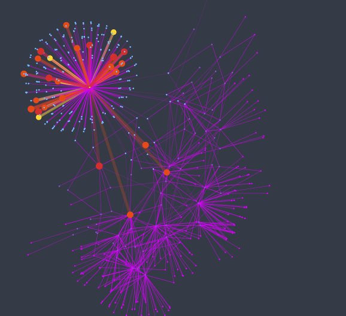
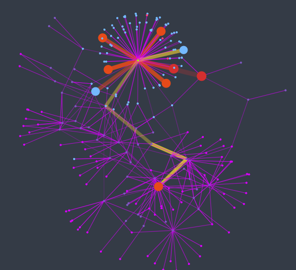

<h1 align="center">
    
</h1>

# Welcome to Cofe
Prioritize OSS vulnerabilities beyond CVSS score, using dependency graph and vulnerability exploitability

## What is it?
It is [Safedep/Vet](https://github.com/safedep/vet) on Steroids, a powerful tool designed to prioritize library and dependency upgrades in your software projects. It uses various heuristics, such as exploitability, reachability, and distinction between internal and external libraries, to make informed decisions about what to upgrade first.

A typical application has 1k+ direct and transitive dependencies. Typically, OSV scanner tools report vulnerabilities prioritized by CVSS score. Cofe assists security engineers and developers in finding the path from the application to the vulnerable location and helps in prioritization. 

| Original Graph              | Cofe Magic   |
| ---------------------- | ---------------------- |
| <p align="center"></p> | <p align="center"></p> |

## Quick Start

### Install Cofe

To install, simply run the following command:

```bash
go install github.com/safedep/cofe@main
```

### Install and Configure Vet
Currently, **Cofe** supports [Safedep/Vet](https://github.com/safedep/vet) as the default dependency scanner. You need to install at least vet community edition to get the vet working.

```bash
go install github.com/safedep/vet@main
vet auth configure --community
```
For other installation options, please refer to [Safedep/Vet](https://github.com/safedep/vet) 

### Run It

To get started with Safedep/Vet on Steroids, run:

```bash
cofe scan -D <Changeme>/<yourproject>/
```

### Sample Output


### Demo 


## Advanced Usage

### Scan Your Internal Repository

Cofe allows you to scan your internal repositories with packages in your private artifact repositories. Here are some examples to scan a python project.

```bash
cofe scan -D <Changeme>/<yourproject>/ --read-std-conf
```

### Visualization

#### Via Graphviz Tool

```bash
cofe scan -D <Changeme>/<yourproject>/ --graphviz g.dot --read-std-conf
```
##### Open the dot file using xdot utility on ubuntu:

```bash
xdot g.dot
```


#### Via Chosmosgraph App (Online visualization tool)

```bash
cofe scan -D <Changeme>/<yourproject>/ --csv g.csv --read-std-conf
```
The above command will generate a few sets of files 
* g.csv - containing edges of the dependency graph after the graph is reduced via various techniques such as reachability analysis
* g.csv.metadata.csv - containing metadata related to nodes, such as score and color useful for visualization
* g.csv.orig.csv: Initial Graph without any optimization
* g.csv.orig.metadata.csv: related metadata of the initial graph

Use [Cosmosgraph app](https://cosmograph.app/run) to upload edge and metadata to visualize

##### Sample Graphs

| Original Graph              | Cofe Magic   |
| ---------------------- | ---------------------- |
| [Demo App Original Graph](https://cosmograph.app/run/?data=https://raw.githubusercontent.com/safedep/cofe/main/samples/csvs/libs/pydemoapp2.csv.orig.csv&meta=https://raw.githubusercontent.com/safedep/cofe/main/samples/csvs/libs/pydemoapp2.csv.orig.csv.metadata.csv&gravity=0.25&repulsion=1&repulsionTheta=1.15&linkSpring=1&linkDistance=10&friction=0.85&renderLinks=true&nodeSizeScale=0.6&linkWidthScale=0.2&linkArrowsSizeScale=0.5&nodeSize=size-vuln_score&nodeColor=color-vuln_color&nodeLabel=id&linkWidth=width-avg-vuln_weight&linkColor=color-vuln_score) | [Demo App Graph After Reduction](https://cosmograph.app/run/?data=https://raw.githubusercontent.com/safedep/cofe/main/samples/csvs/libs/pydemoapp2.csv&meta=https://raw.githubusercontent.com/safedep/cofe/main/samples/csvs/libs/pydemoapp2.csv.metadata.csv&gravity=0.25&repulsion=1&repulsionTheta=1.15&linkSpring=1&linkDistance=10&friction=0.85&renderLinks=true&nodeSizeScale=0.6&linkWidthScale=0.2&linkArrowsSizeScale=0.5&nodeSize=size-vuln_score&nodeColor=color-vuln_color&nodeLabel=id&linkWidth=width-avg-vuln_weight&linkColor=color-vuln_score)  |
| [Langchain Original Graph](https://cosmograph.app/run/?data=https://raw.githubusercontent.com/safedep/cofe/main/samples/csvs/libs/langchan.csv.orig.csv&meta=https://raw.githubusercontent.com/safedep/cofe/main/samples/csvs/libs/langchan.csv.orig.csv.metadata.csv&gravity=0.25&repulsion=1&repulsionTheta=1.15&linkSpring=1&linkDistance=10&friction=0.85&renderLinks=true&nodeSizeScale=0.6&linkWidthScale=0.2&linkArrowsSizeScale=0.5&nodeSize=size-vuln_score&nodeColor=color-vuln_color&nodeLabel=id&linkWidth=width-avg-vuln_weight&linkColor=color-vuln_score) | [Langchain Graph after Reduction](https://cosmograph.app/run/?data=https://raw.githubusercontent.com/safedep/cofe/main/samples/csvs/libs/langchan.csv&meta=https://raw.githubusercontent.com/safedep/cofe/main/samples/csvs/libs/langchan.csv.metadata.csv&gravity=0.25&repulsion=1&repulsionTheta=1.15&linkSpring=1&linkDistance=10&friction=0.85&renderLinks=true&nodeSizeScale=0.6&linkWidthScale=0.2&linkArrowsSizeScale=0.5&nodeSize=size-vuln_score&nodeColor=color-vuln_color&nodeLabel=id&linkWidth=width-avg-vuln_weight&linkColor=color-vuln_score)  |


## How Does It Work?

Upcoming. Stay Tuned...

## Supported Ecosystems

Currently, Cofe supports the following ecosystem:
* Pypi / Python

## Roadmap

Future updates and expansions planned for Safedep/Vet on Steroids:

1. Add support for Java.
2. Integrate with Neo4j.
3. Expand to support NPM packages.
